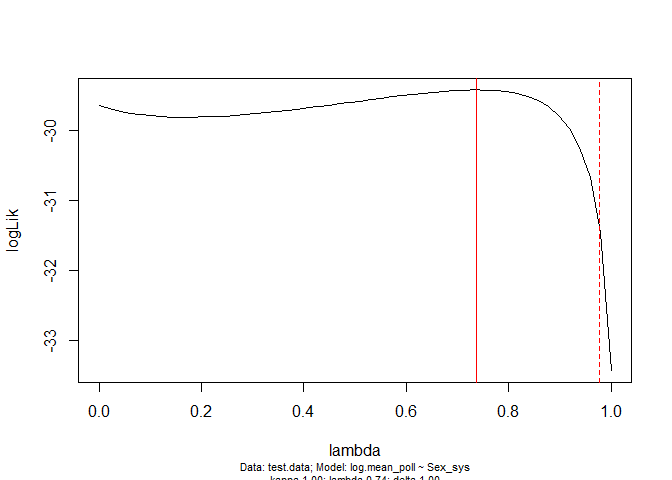

Stigma pollen by sex sys PGLS
================
Claire Smith
2023-06-27

Analysing the relationship between average stigmatic pollen loads and
sex system across 22 wind-pollinated flowering plant species.

``` r
# Load packages
library(tidyverse)
library(car)
library(V.PhyloMaker2)
library(ape)
library(caper)
library(knitr)
library(lme4)
library(emmeans)

source("theme_cs.R")
```

#### Question

Is there an effect of sex system on pollen load, across species?

stigmatic pollen load ~ sex system + collector

- stigmatic pollen load is the response variable (continuous numeric),
  the mean pollen load per stigma per species
- sex system is a categorical test predictor with 3 levels (dioecious,
  monoecious, hermaphroditic)
- collector is a categorical control predictor with 2 levels (CS, JF),
  to control for any effects on pollen load depending on who collected
  the data

``` r
#read the phylogeny into an R object
stig_tree <- read.tree("processed-data/capture_tree.nwk")
#inspect the tree
str(stig_tree)
```

    ## List of 4
    ##  $ edge       : int [1:43, 1:2] 24 25 26 27 27 28 28 26 29 30 ...
    ##  $ edge.length: num [1:43] 4.08 11.81 13.13 106.74 90.13 ...
    ##  $ Nnode      : int 21
    ##  $ tip.label  : chr [1:23] "Ambrosia_artemisiifolia" "Plantago_major" "Plantago_lanceolata" "Chenopodium_album" ...
    ##  - attr(*, "class")= chr "phylo"
    ##  - attr(*, "order")= chr "cladewise"

``` r
#sn.tree is a tree with 22 tips and 20 internal nodes
#plot the tree:
plot.phylo(x=stig_tree, cex=0.7, direction="upwards", no.margin=TRUE)
```

<!-- -->

``` r
## read in data with stigmatic pollen capture and potential covariates
stig <- read.csv("processed-data/stig-no-rep-spp.csv", stringsAsFactors = T) 
# head(stig)
# summary(stig)

# I want the data to be at the species level -- I'll take species-wide averages
stig_sp <- stig %>% group_by(Sex_sys, Species, source) %>% 
  filter(!is.na(Flw_pollen)) %>% 
  summarize(mean_poll = mean(Flw_pollen))
```

    ## `summarise()` has grouped output by 'Sex_sys', 'Species'. You can override
    ## using the `.groups` argument.

``` r
# head(stig_sp)
# summary(stig_sp)
# str(stig_sp)
# View(stig_sp)

# Add some helpful columns
stig_sp <- stig_sp %>% 
  # Correct the spelling of "Schizachne purpurascens"
  mutate(Species = gsub("Schizacne purpurascens", "Schizachne purpurascens", Species)) %>% 
  # Update "Elymus innovatus" to "Leymus innovatus"
  mutate(Species = gsub("Elymus innovatus", "Leymus innovatus", Species)) %>% 
  # create column "Species_" so that species names in this dataset match tip labels in the tree
  mutate(Species_ = gsub(" ", "_", Species)) %>% 
  # create column "Collector" describing who took the data
  mutate(collector = as.factor(case_when(source == "CS2021" ~ "CS",
                               source == "JF2001" ~ "JF",
                               source == "JF2004" ~ "JF"))) %>% 
  as.data.frame()

# Inspect
# str(stig_sp) # 23 species 
# "mean_poll" - mean stigmatic pollen load per species
# "collector" - a factor with 2 levels to control for who collected the data (CS or JF)
# "Sex_sys" - a factor with 3 levels specifying a species' sex system (dioecious, monoecious, or hermaphroditic). 
# check whether there are any missing values:
# sum(is.na(stig_sp)) # no missing values
```

Pre model-fitting checks:

Model fitting:

Join trait and tree data:

``` r
#the function pgls() needs the data and the tree to be combined into a single object, do this with the function comparative.data() from "caper"
# note!!!: trait data CANNOT be a tibble, make sure to convert it to a dataframe or you will get an error!
test.data=comparative.data(phy=stig_tree, data=stig_sp, names.col=Species_, vcv=TRUE, na.omit=FALSE, warn.dropped=TRUE)
# Check for mismatched names:
# stig_tree$tip.label[!(stig_tree$tip.label %in% stig_sp$Species_)]
# -> fixed spelling of Schizachne purpurascens, updated Elymus innovatus to Leymus innovatus

#were any species dropped?
# test.data$dropped # no!
```

Fit PGLS model

``` r
#now fit the PGLS model with maximum likelihood estimated lambda
# full <- pgls(log.mean_poll ~ Sex_sys + collector, dat=test.data, lambda="ML")
# #the argument lambda="ML" means that lambda, the scaling parameter of the variance-covariance matrix is estimated (using maximum likelihood)
# summary(full)
# anova(full)

#drop collector since it's not significant
full2 <- pgls(log.mean_poll ~ Sex_sys, dat=test.data, lambda="ML")
summary(full2)
```

    ## 
    ## Call:
    ## pgls(formula = log.mean_poll ~ Sex_sys, data = test.data, lambda = "ML")
    ## 
    ## Residuals:
    ##      Min       1Q   Median       3Q      Max 
    ## -0.21062 -0.07325 -0.01989  0.07360  0.14232 
    ## 
    ## Branch length transformations:
    ## 
    ## kappa  [Fix]  : 1.000
    ## lambda [ ML]  : 0.738
    ##    lower bound : 0.000, p = 0.50889
    ##    upper bound : 1.000, p = 0.0046432
    ##    95.0% CI   : (NA, 0.977)
    ## delta  [Fix]  : 1.000
    ## 
    ## Coefficients:
    ##                       Estimate Std. Error t value Pr(>|t|)  
    ## (Intercept)            1.40396    0.79057  1.7759  0.09097 .
    ## Sex_syshermaphroditic  1.89133    0.92550  2.0436  0.05439 .
    ## Sex_sysmonoecious      1.54820    0.81334  1.9035  0.07147 .
    ## ---
    ## Signif. codes:  0 '***' 0.001 '**' 0.01 '*' 0.05 '.' 0.1 ' ' 1
    ## 
    ## Residual standard error: 0.1033 on 20 degrees of freedom
    ## Multiple R-squared: 0.1877,  Adjusted R-squared: 0.1065 
    ## F-statistic: 2.311 on 2 and 20 DF,  p-value: 0.125

``` r
# anova(full2)
kable(anova(full2))
```

|           |  Df |    Sum Sq |   Mean Sq |  F value |   Pr(\>F) |
|:----------|----:|----------:|----------:|---------:|----------:|
| Sex_sys   |   2 | 0.0493196 | 0.0246598 | 2.311125 | 0.1250324 |
| Residuals |  20 | 0.2134008 | 0.0106700 |       NA |        NA |

``` r
# PGLS branch length output from summary()
# Branch length transformations:
# kappa  [Fix]  : 1.000
# lambda [ ML]  : 0.738
#    lower bound : 0.000, p = 0.50889
#    upper bound : 1.000, p = 0.0046432
#    95.0% CI   : (NA, 0.977)
# delta  [Fix]  : 1.000
# From the above - the branch scaling parameter lambda isn't significantly different from 0 but it is significantly different from 1. Lambda=0 is equivalent to an OLS model/a "star" phylogeny where no species are more related to each other than others. Lambda=1 represents a Brownian model of evolution. In terms of this model, might mean that PGLS model is no more appropriate than an OLS model because the differences in average pollen load between species aren't particularly affected by where they sit on a phylogeny. 
# I will take a look at lambda's likelihood profile: 
plot(pgls.profile(full2, "lambda"))
```

<!-- -->

Lambda is significantly different from 1 but not 0 - I’ll run two
models, one with the ML lambda (lambda=0.738) and another with lambda=0,
equivalent to an OLS model.

Fitting OLS model and PGLS model with lambda=0.738:

``` r
#OLS model 
# OLS_stig <- lm(log.mean_poll ~ Sex_sys + collector, dat=stig_sp)
# summary(OLS_stig)
# anova(OLS_stig) # again, I'll remove collector since it's not significant and I didn't expect it to have an impact
OLS_stig <- lm(log.mean_poll ~ Sex_sys, dat=stig_sp)
summary(OLS_stig)
```

    ## 
    ## Call:
    ## lm(formula = log.mean_poll ~ Sex_sys, data = stig_sp)
    ## 
    ## Residuals:
    ##      Min       1Q   Median       3Q      Max 
    ## -2.61353 -0.42733 -0.07582  0.73875  1.43244 
    ## 
    ## Coefficients:
    ##                       Estimate Std. Error t value Pr(>|t|)   
    ## (Intercept)             1.0602     0.6659   1.592  0.12704   
    ## Sex_syshermaphroditic   2.6804     0.7192   3.727  0.00133 **
    ## Sex_sysmonoecious       1.4399     0.7362   1.956  0.06459 . 
    ## ---
    ## Signif. codes:  0 '***' 0.001 '**' 0.01 '*' 0.05 '.' 0.1 ' ' 1
    ## 
    ## Residual standard error: 0.9417 on 20 degrees of freedom
    ## Multiple R-squared:  0.4796, Adjusted R-squared:  0.4276 
    ## F-statistic: 9.216 on 2 and 20 DF,  p-value: 0.001456

``` r
anova(OLS_stig)
```

    ## Analysis of Variance Table
    ## 
    ## Response: log.mean_poll
    ##           Df Sum Sq Mean Sq F value   Pr(>F)   
    ## Sex_sys    2 16.346  8.1732  9.2165 0.001456 **
    ## Residuals 20 17.736  0.8868                    
    ## ---
    ## Signif. codes:  0 '***' 0.001 '**' 0.01 '*' 0.05 '.' 0.1 ' ' 1

``` r
#PGLS model with lambda=1
PGLS_stig <- pgls(log.mean_poll ~ Sex_sys, dat=test.data, lambda="ML")
summary(PGLS_stig)
```

    ## 
    ## Call:
    ## pgls(formula = log.mean_poll ~ Sex_sys, data = test.data, lambda = "ML")
    ## 
    ## Residuals:
    ##      Min       1Q   Median       3Q      Max 
    ## -0.21062 -0.07325 -0.01989  0.07360  0.14232 
    ## 
    ## Branch length transformations:
    ## 
    ## kappa  [Fix]  : 1.000
    ## lambda [ ML]  : 0.738
    ##    lower bound : 0.000, p = 0.50889
    ##    upper bound : 1.000, p = 0.0046432
    ##    95.0% CI   : (NA, 0.977)
    ## delta  [Fix]  : 1.000
    ## 
    ## Coefficients:
    ##                       Estimate Std. Error t value Pr(>|t|)  
    ## (Intercept)            1.40396    0.79057  1.7759  0.09097 .
    ## Sex_syshermaphroditic  1.89133    0.92550  2.0436  0.05439 .
    ## Sex_sysmonoecious      1.54820    0.81334  1.9035  0.07147 .
    ## ---
    ## Signif. codes:  0 '***' 0.001 '**' 0.01 '*' 0.05 '.' 0.1 ' ' 1
    ## 
    ## Residual standard error: 0.1033 on 20 degrees of freedom
    ## Multiple R-squared: 0.1877,  Adjusted R-squared: 0.1065 
    ## F-statistic: 2.311 on 2 and 20 DF,  p-value: 0.125

``` r
anova(PGLS_stig)
```

    ## Analysis of Variance Table
    ## Sequential SS for pgls: lambda = 0.74, delta = 1.00, kappa = 1.00
    ## 
    ## Response: log.mean_poll
    ##           Df  Sum Sq Mean Sq F value Pr(>F)
    ## Sex_sys    2 0.04932 0.02466  2.3111  0.125
    ## Residuals 20 0.21340 0.01067

When using an OLS model, sex system has a significant effect on log mean
pollen load (F20,2 = 9.22, p=0.0015). However, using the PGLS model with
lambda=0.738 this effect is absent (F19,2=0.80, p=0.4636).

Post model-fitting checks:

Since lambda was not significantly different from 0, I’ll also do a
linear mixed effects model on pollen receipt by sex system with species
as random effect.

``` r
## Mixed effects mod
# I'll use the data that's not grouped by species - sizenum
stig_filt <- stig %>% 
  filter(!is.na(Flw_pollen)) %>% 
  # Make log mean poll column %>% 
  mutate(Log_avg_poll = log(Flw_pollen + 1)) %>% 
  # Make new column, collector
  mutate(collector = ifelse(source == "CS2021", "CS", "JF")) %>% 
  # Arrange species in order of sex system and alphabetically by species
  mutate(Sex_sys = as.character(Sex_sys),
         Sex_sys = factor(Sex_sys, levels=c("dioecious", "monoecious", "hermaphroditic")) ) %>% 
  arrange(desc(Sex_sys), desc(Species)) %>% 
  mutate(Species =  factor(Species, levels = unique(Species), ordered = T)) 

stig_mixmod <- lmer(Log_avg_poll ~ Sex_sys + (1|Species/Plant), data = stig_filt)
summary(stig_mixmod)
```

    ## Linear mixed model fit by REML ['lmerMod']
    ## Formula: Log_avg_poll ~ Sex_sys + (1 | Species/Plant)
    ##    Data: stig_filt
    ## 
    ## REML criterion at convergence: 15986.1
    ## 
    ## Scaled residuals: 
    ##     Min      1Q  Median      3Q     Max 
    ## -3.3020 -0.6230 -0.0124  0.6092  3.6537 
    ## 
    ## Random effects:
    ##  Groups        Name        Variance Std.Dev.
    ##  Plant:Species (Intercept) 0.2229   0.4721  
    ##  Species       (Intercept) 0.7206   0.8489  
    ##  Residual                  1.0328   1.0163  
    ## Number of obs: 5308, groups:  Plant:Species, 795; Species, 23
    ## 
    ## Fixed effects:
    ##                       Estimate Std. Error t value
    ## (Intercept)             1.0445     0.6051   1.726
    ## Sex_sysmonoecious       0.8913     0.6694   1.332
    ## Sex_syshermaphroditic   2.1353     0.6541   3.265
    ## 
    ## Correlation of Fixed Effects:
    ##             (Intr) Sx_sysm
    ## Sex_sysmncs -0.904        
    ## Sx_syshrmph -0.925  0.836

``` r
# anova(stig_mixmod)
kable(anova(stig_mixmod))
```

|         | npar |   Sum Sq |  Mean Sq |  F value |
|:--------|-----:|---------:|---------:|---------:|
| Sex_sys |    2 | 17.72511 | 8.862554 | 8.580771 |

From the mixed effects model, sex system has a significant effect on
stigmatic pollen load. I’ll use emmeans to run a Tukey’s HSD to
determine which groups are significantly different from each other and
the direction of the difference(s).

``` r
emmeans(stig_mixmod , ~Sex_sys)
```

    ## Note: D.f. calculations have been disabled because the number of observations exceeds 3000.
    ## To enable adjustments, add the argument 'pbkrtest.limit = 5308' (or larger)
    ## [or, globally, 'set emm_options(pbkrtest.limit = 5308)' or larger];
    ## but be warned that this may result in large computation time and memory use.

    ## Note: D.f. calculations have been disabled because the number of observations exceeds 3000.
    ## To enable adjustments, add the argument 'lmerTest.limit = 5308' (or larger)
    ## [or, globally, 'set emm_options(lmerTest.limit = 5308)' or larger];
    ## but be warned that this may result in large computation time and memory use.

    ##  Sex_sys        emmean    SE  df asymp.LCL asymp.UCL
    ##  dioecious        1.04 0.605 Inf    -0.141      2.23
    ##  monoecious       1.94 0.286 Inf     1.375      2.50
    ##  hermaphroditic   3.18 0.248 Inf     2.693      3.67
    ## 
    ## Degrees-of-freedom method: asymptotic 
    ## Confidence level used: 0.95

``` r
emmeans(stig_mixmod , list(pairwise ~ Sex_sys), adjust = "tukey")
```

    ## Note: D.f. calculations have been disabled because the number of observations exceeds 3000.
    ## To enable adjustments, add the argument 'pbkrtest.limit = 5308' (or larger)
    ## [or, globally, 'set emm_options(pbkrtest.limit = 5308)' or larger];
    ## but be warned that this may result in large computation time and memory use.
    ## Note: D.f. calculations have been disabled because the number of observations exceeds 3000.
    ## To enable adjustments, add the argument 'lmerTest.limit = 5308' (or larger)
    ## [or, globally, 'set emm_options(lmerTest.limit = 5308)' or larger];
    ## but be warned that this may result in large computation time and memory use.

    ## $`emmeans of Sex_sys`
    ##  Sex_sys        emmean    SE  df asymp.LCL asymp.UCL
    ##  dioecious        1.04 0.605 Inf    -0.141      2.23
    ##  monoecious       1.94 0.286 Inf     1.375      2.50
    ##  hermaphroditic   3.18 0.248 Inf     2.693      3.67
    ## 
    ## Degrees-of-freedom method: asymptotic 
    ## Confidence level used: 0.95 
    ## 
    ## $`pairwise differences of Sex_sys`
    ##  1                           estimate    SE  df z.ratio p.value
    ##  dioecious - monoecious        -0.891 0.669 Inf  -1.332  0.3776
    ##  dioecious - hermaphroditic    -2.135 0.654 Inf  -3.265  0.0031
    ##  monoecious - hermaphroditic   -1.244 0.379 Inf  -3.283  0.0030
    ## 
    ## Degrees-of-freedom method: asymptotic 
    ## P value adjustment: tukey method for comparing a family of 3 estimates

``` r
# plot(emmeans(size_mixmod , ~Sex_sys))
em_stig <- emmeans(stig_mixmod , ~Sex_sys) %>%  as.data.frame()
```

    ## Note: D.f. calculations have been disabled because the number of observations exceeds 3000.
    ## To enable adjustments, add the argument 'pbkrtest.limit = 5308' (or larger)
    ## [or, globally, 'set emm_options(pbkrtest.limit = 5308)' or larger];
    ## but be warned that this may result in large computation time and memory use.
    ## Note: D.f. calculations have been disabled because the number of observations exceeds 3000.
    ## To enable adjustments, add the argument 'lmerTest.limit = 5308' (or larger)
    ## [or, globally, 'set emm_options(lmerTest.limit = 5308)' or larger];
    ## but be warned that this may result in large computation time and memory use.

Plot estimated marginal means for stigma load by sex system

``` r
# Plot estimated marginal means: 
ggplot(data=em_stig, aes(x=Sex_sys, y=emmean)) + 
  geom_point(size=5) + 
  geom_errorbar(aes(ymin=pmax(0,asymp.LCL), ymax=asymp.UCL), width=0.1) +
  # Add letters corresponding to Tukey's HSD
  geom_text(aes(x=1, y=log(10)), label="A", size=6) + 
  geom_text(aes(x=2, y=log(13)), label="A", size=6) + 
  geom_text(aes(x=3, y=log(42)), label="B", size=6) + 
  scale_y_continuous(name="Stigmatic pollen load",
                     breaks = log(c(0,1,2,5,10,25,50,100,200,500,1000, 2500)+1),
                     labels = c(0,1,2,5,10,25,50,100,200,500,1000, 2500),
                     limits=c(0,NA)) +
  scale_x_discrete(name = "Sex system", labels = c("Dioecious", "Monoecious", "Hermaphroditic")) + 
  theme_cs(fontsize = 20)
```

<!-- -->

In the mixed effects model, sex system does have a significant effect on
stigmatic pollen loads. A Tukey’s HSD test shows that hermaphroditic
species capture significantly more pollen than dioecious or monoecious
species, but pollen capture is not significantly different between
dioecious and monoecious species.

Plot estimated marginal means for pollen size per sex system, with
points for means:

``` r
stig_ind <- stig_filt %>% group_by(Species, Sex_sys, Date, Site, Plant) %>% 
  summarize(mean_poll=mean(Flw_pollen, na.rm=T),
            log.mean_poll=log(mean_poll+1))
```

    ## `summarise()` has grouped output by 'Species', 'Sex_sys', 'Date', 'Site'. You
    ## can override using the `.groups` argument.

``` r
# Plot estimated marginal means: 
ggplot(data=em_stig, aes(x=Sex_sys, y=emmean)) + 
  geom_point(size=3) + 
  geom_errorbar(aes(ymin=pmax(0,asymp.LCL), ymax=asymp.UCL), width=0.1) +

  # Raw data (individual means) with stat dot histograms
  # ggdist::stat_dots(data=sizenum, aes(x=Sex_sys, y=Avg_diam),
  #   side = "left",
  #   dotsize = .8,
  #   justification = 1.2,
  #   binwidth = .3) +
  # Raw data (individual means) with jittered points
  gghalves::geom_half_point(data=stig_ind, aes(x=Sex_sys, y=log.mean_poll),
    ## draw jitter on the left
    side = "l",
    ## control range of jitter
    range_scale = .4,
    ## add some transparency
    alpha = .3,
    size=1) +
#   
#   # Species means
  gghalves::geom_half_point(data=stig_sp, aes(x=Sex_sys, y=log.mean_poll),
    ## draw jitter on the right
    side = "r",
    ## control range of jitter
    transformation = position_identity(),
    # transformation = position_jitter(w = 0, h = 0),  # we do NOT want vertical jitter!
    ## add some transparency
    alpha = .7,
    size=5,
    shape=95) +
  scale_y_continuous(name="Stigmatic pollen load",
                     breaks = log(c(0,1,2,5,10,25,50,100,200,500,1000, 2500)+1),
                     labels = c(0,1,2,5,10,25,50,100,200,500,1000, 2500),
                     limits=c(0,NA)) +
  scale_x_discrete(name = "Sex system", labels = c("Dioecious", "Monoecious", "Hermaphroditic")) + 
  theme_cs()
```

<!-- -->
