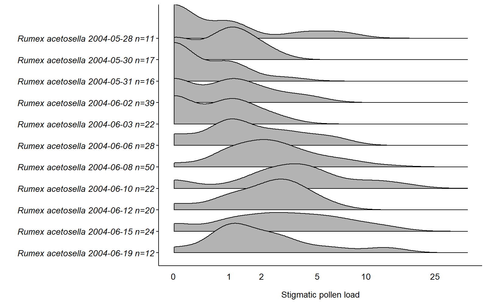

Untitled
================
Claire Smith
2023-08-14

# Stigmatic pollen loads by date

``` r
# Load packages
library(tidyverse)
library(ggplot2)
library(ggridges)

# Source files
source("clean-dat.R") # get cleaned data
source("theme_cs.R")
```

One figure per species with various pollen load distributions by date

``` r
stig2 <- read.csv("processed-data/stig-all.csv", stringsAsFactors = T)
```

``` r
stig2$Date <- as.Date(stig2$Date)
stig2$Sex_sys <- as.factor(stig2$Sex_sys)
stig2$source <- as.factor(stig2$source)
# I'll go through each species and run a model predicting pollen capture by flower height
# Since many likely have log-normal distributions of pollen capture, I'll create a log flw pollen variable now to # save time -- but will still check each species individually 
stigl <- stig2 %>% 
  mutate(Log_flw_pollen=log(Flw_pollen + 1)) %>% 
  rowwise %>% 
  mutate(Avg_dist = mean(c_across(c('D1', 'D2', 'D3', 'D4', 'D5')), na.rm=TRUE)) %>% 
  mutate(Inv_avg_dist = 1/Avg_dist) %>% 
  # Take only entries stigma length data
  filter(!is.na(Flw_pollen) & !is.na(Infl_max) & !is.na(Avg_dist) &!is.na(Stigma_length) & !is.na(Date)) %>%
  droplevels() %>% 
  filter((Species=="Carex hirtifolia" & Stigma_length>0.5) | Species != "Carex hirtifolia") # remove C. hirtifolia outlier with stigma length = 0.2

# Separate pollen load data by date
stig_date_sum <- stigl %>% 
  mutate(Date = as.Date(Date),
         Species_date=paste(Species, Date)) %>% 
  group_by(Species_date, Species) %>% 
  summarize(n=n()) 
```

    ## `summarise()` has grouped output by 'Species_date'. You can override using the
    ## `.groups` argument.

``` r
# View(stigl %>% 
#   mutate(Date = as.Date(Date),
#          Species_date=paste(Species, Date)) %>% 
#   group_by(Species_date, Species) %>% 
#   summarize(n=n()))

stig_date <- stigl %>% 
  mutate(Species_date=paste(Species, Date)) %>% 
  filter(Species_date %in% stig_date_sum$Species_date) %>% 
  filter(!is.na(Date))

# New dataset where there's also the number of individuals per species-date combo
stig_date_n <- left_join(stig_date, stig_date_sum, by=c("Species_date","Species"))
stig_date_n$Species_date_n <- paste0(" ",stig_date_n$Species_date, " n=",stig_date_n$n)
stig_date_n <- stig_date_n %>% 
  arrange(desc(Species_date_n))
stig_date_n$Species_date_n <- factor(stig_date_n$Species_date_n, levels=unique(stig_date_n$Species_date_n), ordered=T)
```

``` r
spp <- as.character(unique(stig_date_n$Species))

stig_date_n %>% 
    filter(Species == spp[13]) %>% 
  ggplot(aes(x=log(Flw_pollen+1), y=Species_date_n)) +
    geom_density_ridges2() + 
    scale_x_continuous(name="Stigmatic pollen load",
                       breaks = log(c(0,1,2,5,10,25,50,100,200,500,1000, 2500)+1),
                       labels = c(0,1,2,5,10,25,50,100,200,500,1000, 2500),
                       limits=c(0,NA)) +
    scale_y_discrete() +
    ylab(label="") + 
    guides(fill="none") + 
    theme_cs(font="sans", fontsize=10) + 
    theme(axis.text.y = element_text(face = "italic"),
          axis.ticks.y = element_line())
```

    ## Picking joint bandwidth of 0.299

<!-- -->

``` r
stig_date_n %>% 
    filter(Species == spp[12]) %>% 
  ggplot(aes(x=log(Flw_pollen+1), y=Species_date_n)) +
    geom_density_ridges2() + 
    scale_x_continuous(name="Stigmatic pollen load",
                       breaks = log(c(0,1,2,5,10,25,50,100,200,500,1000, 2500)+1),
                       labels = c(0,1,2,5,10,25,50,100,200,500,1000, 2500),
                       limits=c(0,NA)) +
    scale_y_discrete() +
    ylab(label="") + 
    guides(fill="none") + 
    theme_cs(font="sans", fontsize=10) + 
    theme(axis.text.y = element_text(face = "italic"),
          axis.ticks.y = element_line())
```

    ## Picking joint bandwidth of 0.391

<!-- -->

``` r
stig_date_n %>% 
    filter(Species == spp[11]) %>% 
  ggplot(aes(x=log(Flw_pollen+1), y=Species_date_n)) +
    geom_density_ridges2() + 
    scale_x_continuous(name="Stigmatic pollen load",
                       breaks = log(c(0,1,2,5,10,25,50,100,200,500,1000, 2500)+1),
                       labels = c(0,1,2,5,10,25,50,100,200,500,1000, 2500),
                       limits=c(0,NA)) +
    scale_y_discrete() +
    ylab(label="") + 
    guides(fill="none") + 
    theme_cs(font="sans", fontsize=10) + 
    theme(axis.text.y = element_text(face = "italic"),
          axis.ticks.y = element_line())
```

    ## Picking joint bandwidth of 0.46

<!-- -->

``` r
stig_date_n %>% 
    filter(Species == spp[10]) %>% 
  ggplot(aes(x=log(Flw_pollen+1), y=Species_date_n)) +
    geom_density_ridges2() + 
    scale_x_continuous(name="Stigmatic pollen load",
                       breaks = log(c(0,1,2,5,10,25,50,100,200,500,1000, 2500)+1),
                       labels = c(0,1,2,5,10,25,50,100,200,500,1000, 2500),
                       limits=c(0,NA)) +
    scale_y_discrete() +
    ylab(label="") + 
    guides(fill="none") + 
    theme_cs(font="sans", fontsize=10) + 
    theme(axis.text.y = element_text(face = "italic"),
          axis.ticks.y = element_line())
```

    ## Picking joint bandwidth of 0.369

<!-- -->

``` r
stig_date_n %>% 
    filter(Species == spp[9]) %>% 
  ggplot(aes(x=log(Flw_pollen+1), y=Species_date_n)) +
    geom_density_ridges2() + 
    scale_x_continuous(name="Stigmatic pollen load",
                       breaks = log(c(0,1,2,5,10,25,50,100,200,500,1000, 2500)+1),
                       labels = c(0,1,2,5,10,25,50,100,200,500,1000, 2500),
                       limits=c(0,NA)) +
    scale_y_discrete() +
    ylab(label="") + 
    guides(fill="none") + 
    theme_cs(font="sans", fontsize=10) + 
    theme(axis.text.y = element_text(face = "italic"),
          axis.ticks.y = element_line())
```

    ## Picking joint bandwidth of 0.282

<!-- -->

``` r
stig_date_n %>% 
    filter(Species == spp[8]) %>% 
  ggplot(aes(x=log(Flw_pollen+1), y=Species_date_n)) +
    geom_density_ridges2() + 
    scale_x_continuous(name="Stigmatic pollen load",
                       breaks = log(c(0,1,2,5,10,25,50,100,200,500,1000, 2500)+1),
                       labels = c(0,1,2,5,10,25,50,100,200,500,1000, 2500),
                       limits=c(0,NA)) +
    scale_y_discrete() +
    ylab(label="") + 
    guides(fill="none") + 
    theme_cs(font="sans", fontsize=10) + 
    theme(axis.text.y = element_text(face = "italic"),
          axis.ticks.y = element_line())
```

    ## Picking joint bandwidth of 0.338

<!-- -->

``` r
stig_date_n %>% 
    filter(Species == spp[7]) %>% 
  ggplot(aes(x=log(Flw_pollen+1), y=Species_date_n)) +
    geom_density_ridges2() + 
    scale_x_continuous(name="Stigmatic pollen load",
                       breaks = log(c(0,1,2,5,10,25,50,100,200,500,1000, 2500)+1),
                       labels = c(0,1,2,5,10,25,50,100,200,500,1000, 2500),
                       limits=c(0,NA)) +
    scale_y_discrete() +
    ylab(label="") + 
    guides(fill="none") + 
    theme_cs(font="sans", fontsize=10) + 
    theme(axis.text.y = element_text(face = "italic"),
          axis.ticks.y = element_line())
```

    ## Picking joint bandwidth of 0.382

<!-- -->

``` r
stig_date_n %>% 
    filter(Species == spp[6]) %>% 
  ggplot(aes(x=log(Flw_pollen+1), y=Species_date_n)) +
    geom_density_ridges2() + 
    scale_x_continuous(name="Stigmatic pollen load",
                       breaks = log(c(0,1,2,5,10,25,50,100,200,500,1000, 2500)+1),
                       labels = c(0,1,2,5,10,25,50,100,200,500,1000, 2500),
                       limits=c(0,NA)) +
    scale_y_discrete() +
    ylab(label="") + 
    guides(fill="none") + 
    theme_cs(font="sans", fontsize=10) + 
    theme(axis.text.y = element_text(face = "italic"),
          axis.ticks.y = element_line())
```

    ## Picking joint bandwidth of 0.514

<!-- -->

``` r
stig_date_n %>% 
    filter(Species == spp[5]) %>% 
  ggplot(aes(x=log(Flw_pollen+1), y=Species_date_n)) +
    geom_density_ridges2() + 
    scale_x_continuous(name="Stigmatic pollen load",
                       breaks = log(c(0,1,2,5,10,25,50,100,200,500,1000, 2500)+1),
                       labels = c(0,1,2,5,10,25,50,100,200,500,1000, 2500),
                       limits=c(0,NA)) +
    scale_y_discrete() +
    ylab(label="") + 
    guides(fill="none") + 
    theme_cs(font="sans", fontsize=10) + 
    theme(axis.text.y = element_text(face = "italic"),
          axis.ticks.y = element_line())
```

    ## Picking joint bandwidth of 0.258

<!-- -->

``` r
stig_date_n %>% 
    filter(Species == spp[4]) %>% 
  ggplot(aes(x=log(Flw_pollen+1), y=Species_date_n)) +
    geom_density_ridges2() + 
    scale_x_continuous(name="Stigmatic pollen load",
                       breaks = log(c(0,1,2,5,10,25,50,100,200,500,1000, 2500)+1),
                       labels = c(0,1,2,5,10,25,50,100,200,500,1000, 2500),
                       limits=c(0,NA)) +
    scale_y_discrete() +
    ylab(label="") + 
    guides(fill="none") + 
    theme_cs(font="sans", fontsize=10) + 
    theme(axis.text.y = element_text(face = "italic"),
          axis.ticks.y = element_line())
```

    ## Picking joint bandwidth of 0.413

<!-- -->

``` r
stig_date_n %>% 
    filter(Species == spp[3]) %>% 
  ggplot(aes(x=log(Flw_pollen+1), y=Species_date_n)) +
    geom_density_ridges2() + 
    scale_x_continuous(name="Stigmatic pollen load",
                       breaks = log(c(0,1,2,5,10,25,50,100,200,500,1000, 2500)+1),
                       labels = c(0,1,2,5,10,25,50,100,200,500,1000, 2500),
                       limits=c(0,NA)) +
    scale_y_discrete() +
    ylab(label="") + 
    guides(fill="none") + 
    theme_cs(font="sans", fontsize=10) + 
    theme(axis.text.y = element_text(face = "italic"),
          axis.ticks.y = element_line())
```

    ## Picking joint bandwidth of 0.63

<!-- -->

``` r
stig_date_n %>% 
    filter(Species == spp[2]) %>% 
  ggplot(aes(x=log(Flw_pollen+1), y=Species_date_n)) +
    geom_density_ridges2() + 
    scale_x_continuous(name="Stigmatic pollen load",
                       breaks = log(c(0,1,2,5,10,25,50,100,200,500,1000, 2500)+1),
                       labels = c(0,1,2,5,10,25,50,100,200,500,1000, 2500),
                       limits=c(0,NA)) +
    scale_y_discrete() +
    ylab(label="") + 
    guides(fill="none") + 
    theme_cs(font="sans", fontsize=10) + 
    theme(axis.text.y = element_text(face = "italic"),
          axis.ticks.y = element_line())
```

    ## Picking joint bandwidth of 0.268

<!-- -->

``` r
stig_date_n %>% 
    filter(Species == spp[1]) %>% 
  ggplot(aes(x=log(Flw_pollen+1), y=Species_date_n)) +
    geom_density_ridges2() + 
    scale_x_continuous(name="Stigmatic pollen load",
                       breaks = log(c(0,1,2,5,10,25,50,100,200,500,1000, 2500)+1),
                       labels = c(0,1,2,5,10,25,50,100,200,500,1000, 2500),
                       limits=c(0,NA)) +
    scale_y_discrete() +
    ylab(label="") + 
    guides(fill="none") + 
    theme_cs(font="sans", fontsize=10) + 
    theme(axis.text.y = element_text(face = "italic"),
          axis.ticks.y = element_line())
```

    ## Picking joint bandwidth of 0.299

<!-- -->
