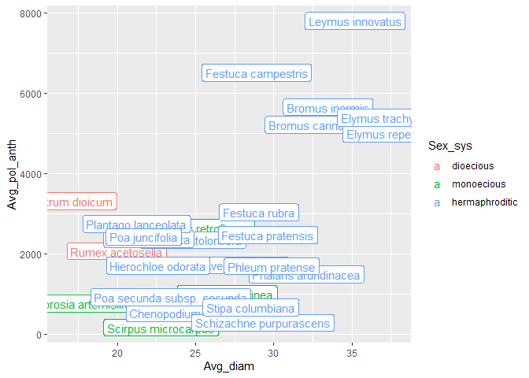
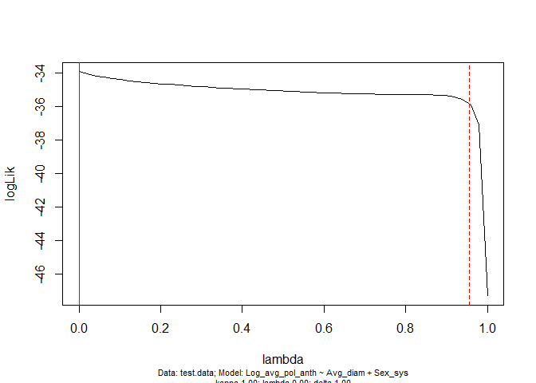
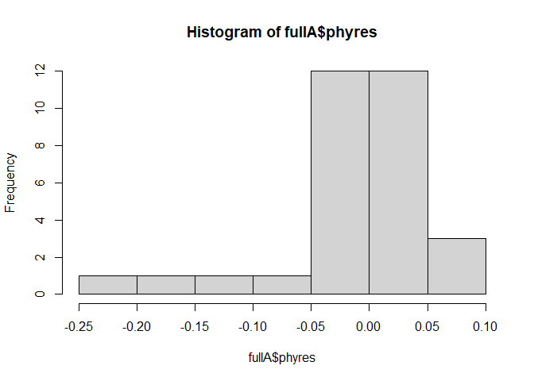
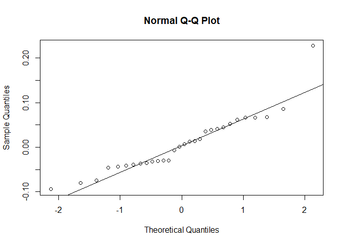
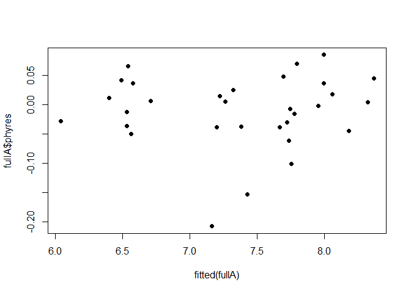

PGLS pollen size by sex system
================
Claire Smith
2023-06-27

PGLS analysis based on tutorial by Roger Mundry from the Chapter 6
practical material from Modern Phylogenetic Comparative Methods and
Their Application in Evolutionary Biology (Springer 2014). Link:
<https://www.mpcm-evolution.com/practice/online-practical-material-chapter-6/chapter-6-1exercises-testing-assumptions-statistical-issues-framework-phylogenetic-generalized-least-squares>

I’ll run two analyses:

B. Does pollen size vary in wind-pollinated species according to their
sex system? Specifically, do dioecious species make smaller pollen (to
facilitate long-distance dispersal)?

model: pollen size ~ sex system + collector

A. Is there an effect of sex system on pollen number? Do we see a
size-number tradeoff across species (i.e. is there an effect of pollen
size on number)?

model: pollen production/anther ~ pollen size + sex system + collector

Variables: - pollen production/anther is average pollen produced per
anther per species - pollen size is the mean diameter of pollen grains
per species - sex system is a categorical test predictor with 3 levels
(dioecious, monoecious, hermaphroditic) - collector is a categorical
control predictor with 2 levels (CS, JF), to control for any effects on
pollen load depending on who collected the data

``` r
# Load packages
library(dplyr)
library(car)
library(V.PhyloMaker2)
library(ape)
library(dplyr)
library(caper)

library(lme4)
library(lmerTest)
library(ggplot2)
library(emmeans)
library(gghalves)
library(ggdist)

library(knitr) # to make nice tables

source("theme_cs.R")
```

### Read in and prepare data

Read in the tree data:

``` r
#read the phylogeny into an R object
sizenum_tree <- read.tree("processed-data/sizenum_tree.nwk")
#inspect the tree
# str(sizenum_tree)
```

The tree has 29 tips and 27 internal nodes. Plot the tree:

``` r
plot.phylo(x=sizenum_tree, cex=0.7, direction="upwards", no.margin=TRUE)
```

<!-- -->

Read in and prepare trait data:

``` r
## read in data with pollen size/number 
sizenum_raw <- read.csv("processed-data/size-prod-norep.csv", stringsAsFactors = T)
# head(sizenum)
# summary(sizenum)
# str(sizenum)
```

I want the data to be at the species level – I’ll take species-wide
averages. I’ll also filter the data so that I only keep species with at
least 5 individuals. At the same time, I’ll edit some species names to
match those in the tree dataset (in later analyses mismatches come up as
dropped data when I try to join tree and trait data together). I’ll add
a new column, “Species\_”, that has an underscore between genus and
species, to match the species name format in the tree data. And I’ll
also add a “collector” column that specifies whether I (CS) or JF
collected the data, in case it has an effect.

``` r
# species-wide averages
sizenum <- sizenum_raw %>% 
  # Update species names to match tree
  # Agropyron trachycaulum => Elymus trachycaulus
  # Elymus innovatus => Leymus innovatus
  mutate(Species = gsub("Agropyron trachycaulum", "Elymus trachycaulus", Species),
         Species = gsub("Elymus innovatus", "Leymus innovatus", Species)) %>% 
  mutate(Species = gsub("Bcarianatus", "Bromus carinatus", Species),
         Species = gsub("Astolonifera", "Agrostis stolonifera", Species)) %>% 
  # Species_ to match style of species names in phylogeny
  mutate(Species_ = gsub(" ", "_", Species)) %>% 
  # create column "Collector" describing who took the data
  mutate(collector = as.factor(case_when(source == "CS2021" ~ "CS",
                               source == "JF2001" ~ "JF",
                               source == "JF2004" ~ "JF"))) %>% 
  # Arrange species in order of sex system and alphabetically by species
  mutate(Sex_sys = as.character(Sex_sys),
         Sex_sys = factor(Sex_sys, levels=c("dioecious", "monoecious", "hermaphroditic")) ) %>% 
  arrange(Sex_sys, Species) %>% 
  filter(!is.na(Avg_diam) & !is.na(Avg_pol_anth))

sizenum_sp <- sizenum %>% 
  group_by(Sex_sys, Species, Species_, source) %>% 
  summarize(Avg_pol_anth = mean(Avg_pol_anth),
            Avg_diam = mean(Avg_diam),
            N = n()) %>%
  filter(N>=3) %>% # Keep only species with at least 3 individuals
  droplevels() %>% 
  as.data.frame()
```

    ## `summarise()` has grouped output by 'Sex_sys', 'Species', 'Species_'. You can
    ## override using the `.groups` argument.

``` r
# add this to species-level data 
# head(sizenum_sp)
# summary(sizenum_sp) # 31 species
# str(sizenum_sp) 
# sum(is.na(sizenum_sp)) # no missing data
# # sample size per sex system: 
# sizenum_sp %>% group_by(Sex_sys, Species) %>% summarize(n=n()) %>% group_by(Sex_sys) %>%  summarize(n=n())
# # sample size per species:
# print(sizenum_sp %>% group_by(Sex_sys, Species) %>% summarize(N=N), n=Inf)
```

The resulting dataset has 31 species.

Key variables:

- “Avg_pol_anth” - mean pollen production per anther, per species
- “Avg_diam” - the mean pollen diameter (per flower) per species in um,
  averaged within individuals then across individuals to get a
  species-wide mean
- “collector” - a factor with 2 levels to control for who collected the
  data (CS or JF)
- “Sex_sys” - a factor with 3 levels specifying a species’ sex system
  (dioecious, monoecious, or hermaphroditic).

## Pre model-fitting checks:

#### Histograms and boxplots to check distributions of predictors and response variables

Pollen size:

``` r
# pollen size: 
ggplot(sizenum_sp) + 
  geom_histogram(aes(x=Avg_diam)) + 
  theme_cs()
```

    ## `stat_bin()` using `bins = 30`. Pick better value with `binwidth`.

<!-- -->

``` r
ggplot(sizenum_sp) + 
  geom_histogram(aes(x=Avg_diam)) + 
  facet_grid(Sex_sys~.) + 
  theme_cs()
```

    ## `stat_bin()` using `bins = 30`. Pick better value with `binwidth`.

<!-- -->

``` r
ggplot(sizenum_sp) + 
  geom_boxplot(aes(y=Avg_diam, x=Sex_sys)) + 
  xlab("Sex system") + 
  ylab("Pollen diameter") + 
  theme_cs()
```

<!-- -->

``` r
#looks okay, not too skewed, no obvious outliers
```

Pollen production:

``` r
# pollen number: 
ggplot(sizenum_sp) + 
  geom_histogram(aes(x=Avg_pol_anth)) + 
  theme_cs()
```

    ## `stat_bin()` using `bins = 30`. Pick better value with `binwidth`.

<!-- -->

``` r
# looks pretty right-skewed
ggplot(sizenum_sp) + 
  geom_histogram(aes(x=Avg_pol_anth)) + 
  facet_grid(Sex_sys~.) + 
  theme_cs()
```

    ## `stat_bin()` using `bins = 30`. Pick better value with `binwidth`.

<!-- -->

``` r
ggplot(sizenum_sp) + 
  geom_boxplot(aes(y=Avg_pol_anth, x=Sex_sys)) + 
  xlab("Sex system") + 
  ylab("Pollen production") + 
  theme_cs()
```

<!-- -->

``` r
# log pollen number: 
# min(sizenum_sp$Avg_pol_anth) # non-zero - can log-transform
sizenum_sp$Log_avg_pol_anth <- log(sizenum_sp$Avg_pol_anth)

ggplot(sizenum_sp) + 
  geom_histogram(aes(x=Log_avg_pol_anth)) + 
  theme_cs()
```

    ## `stat_bin()` using `bins = 30`. Pick better value with `binwidth`.

<!-- -->

``` r
# looks more symmetrical!
ggplot(sizenum_sp) + 
  geom_histogram(aes(x=Log_avg_pol_anth)) + 
  facet_grid(Sex_sys~.) + 
  theme_cs()
```

    ## `stat_bin()` using `bins = 30`. Pick better value with `binwidth`.

<!-- -->

``` r
ggplot(sizenum_sp) + 
  geom_boxplot(aes(y=Log_avg_pol_anth, x=Sex_sys)) + 
  xlab("Sex system") + 
  ylab("Log pollen production") + 
  theme_cs()
```

<!-- -->

It’s a little had to tell because there are only 2 species in the
dioecious group, but it looks like overall pollen production tends to
have a right-skewed distribution, so I will log transform it to make the
distribution more symmetric.

Sex system and collector:

``` r
#inspect the frequency distributions of the factors
table(sizenum_sp$collector) #CS:1, JF:26 #only 1 CS! Will not consider collector for the analyses then
```

    ## < table of extent 0 >

``` r
table(sizenum_sp$Sex_sys)
```

    ## 
    ##      dioecious     monoecious hermaphroditic 
    ##              2              9             20

``` r
     # dioecious     monoecious hermaphroditic 
     #         2              8             17 
```

#### Multicollinearity

Are there collinear predictors? Test for multicollinearity using
function vif from package “car” (Fox & Weisberg 2011).

``` r
# are size and sex system collinear? 
# the only model with multiple predictors is this one: 
testmod <- lm(Log_avg_pol_anth ~ Avg_diam + Sex_sys, data=sizenum_sp)
vif(mod=testmod) # use vif() from "car"
```

    ##              GVIF Df GVIF^(1/(2*Df))
    ## Avg_diam 1.501524  1        1.225367
    ## Sex_sys  1.501524  2        1.106963

``` r
# no! (not over 10)"
```

#### Combine data

To do the phylogenetic least squares analysis (PGLS), the function
pgls() needs the data and the tree to be combined into a single object,
do this with the function comparative.data() from “caper”:

``` r
test.data=comparative.data(phy=sizenum_tree, data=sizenum_sp, names.col=Species_, vcv=TRUE, na.omit=FALSE, warn.dropped=TRUE)
```

    ## Warning in comparative.data(phy = sizenum_tree, data = sizenum_sp, names.col =
    ## Species_, : Data dropped in compiling comparative data object

``` r
#were any species dropped?
test.data$dropped # "Setaria_viridis"
```

    ## $tips
    ## [1] "Setaria_viridis"
    ## 
    ## $unmatched.rows
    ## character(0)

## Effect of sex system on pollen number

A. Is there an effect of sex system on pollen number? Do we see a
size-number tradeoff across species (i.e. is there an effect of pollen
size on number)?

Take a look at the data before running the model - it looks like there
could be a positive trend - or two groups?

``` r
ggplot(sizenum_sp, aes(x=Avg_diam, y=Avg_pol_anth, colour=Sex_sys, label=Species)) +
  geom_point() + 
  geom_label()
```

<!-- -->

model: pollen production/anther ~ pollen size + sex system + collector

First I’ll fit the full model with branch length parameter lambda
estimated using maximum likelihood.

``` r
# fit the PGLS model:
fullA <- pgls(Log_avg_pol_anth ~ Avg_diam + Sex_sys, dat=test.data, lambda="ML")
summary(fullA)
```

    ## 
    ## Call:
    ## pgls(formula = Log_avg_pol_anth ~ Avg_diam + Sex_sys, data = test.data, 
    ##     lambda = "ML")
    ## 
    ## Residuals:
    ##       Min        1Q    Median        3Q       Max 
    ## -0.207734 -0.038010 -0.002005  0.030939  0.085092 
    ## 
    ## Branch length transformations:
    ## 
    ## kappa  [Fix]  : 1.000
    ## lambda [ ML]  : 0.000
    ##    lower bound : 0.000, p = 1    
    ##    upper bound : 1.000, p = 2.3125e-07
    ##    95.0% CI   : (NA, 0.957)
    ## delta  [Fix]  : 1.000
    ## 
    ## Coefficients:
    ##                        Estimate Std. Error t value  Pr(>|t|)    
    ## (Intercept)            6.536416   0.814189  8.0281 1.258e-08 ***
    ## Avg_diam               0.073011   0.032934  2.2168  0.035244 *  
    ## Sex_sysmonoecious     -1.801457   0.634164 -2.8407  0.008459 ** 
    ## Sex_syshermaphroditic -0.921018   0.667097 -1.3806  0.178714    
    ## ---
    ## Signif. codes:  0 '***' 0.001 '**' 0.01 '*' 0.05 '.' 0.1 ' ' 1
    ## 
    ## Residual standard error: 0.0665 on 27 degrees of freedom
    ## Multiple R-squared: 0.4388,  Adjusted R-squared: 0.3765 
    ## F-statistic: 7.038 on 3 and 27 DF,  p-value: 0.001206

``` r
# kable(summary(fullA)$coefficients)
# ML lambda estimate is 0, not significantly different from 0, significantly different from 1. 
# anova(fullA) # sig effect of diam and sex sys
kable(anova(fullA))
```

|           |  Df |    Sum Sq |   Mean Sq |  F value |   Pr(\>F) |
|:----------|----:|----------:|----------:|---------:|----------:|
| Avg_diam  |   1 | 0.0385005 | 0.0385005 | 8.707215 | 0.0064800 |
| Sex_sys   |   2 | 0.0548542 | 0.0274271 | 6.202868 | 0.0060724 |
| Residuals |  27 | 0.1193854 | 0.0044217 |       NA |        NA |

The PGLS model showed that size and sex system both have a significant
effect on pollen production at alpha=0.05.

Take a look at likelihood surface for lambda.

``` r
plot(pgls.profile(fullA, "lambda")) # strange likelihood surface - it peaks at 0, drops off sharply around 1
```

<!-- -->

The surface looks kind of flat - not sure how valid it is to say the
estimate should be 0.

#### Post model fit checks

I’ll inspect the residuals for normality and homogeneity.

``` r
#inspect the phylogenetic residuals for normality:
hist(fullA$phyres) #looks pretty normal
```

<!-- -->

``` r
qqnorm(fullA$phyres) 
qqline(fullA$phyres) #looks okay? deviates from the line at the extremes but is otherwise pretty close
```

<!-- -->

``` r
#inspect phylogenetic residuals for homogeneity:
plot(x=fitted(fullA), y=fullA$phyres, pch=19)
```

<!-- -->

``` r
# only 2 dieocious species - 
```

Two points clearly have greater fitted values and less variance - these
are likely the dioecious species. There being only two dioecious species
might give these species undue influence in the model and not represent
their sex system well.

### Linear mixed effects model

Since the ML lambda was not significantly different from 0 (lambda=0
corresponds to a normal OLS model, no phylogenetic signal in the data),
I’ll also run a linear mixed effects model with species as a random
effect. Since there was no evidence of phylogenetic signal (lambda not
being significantly different from 0), this will let me use a fuller
dataset with individual-level rather than species-level data for pollen
size, to capture more within-species variation.

``` r
# sizenum has the individual-level size/number data
# For the mixed-effect model, I'll only take the species with at least 10 individuals measured per group. 
spp_over10 <- sizenum %>% group_by(Sex_sys, Species) %>% summarize(n=n()) %>% filter(n>=10)
```

    ## `summarise()` has grouped output by 'Sex_sys'. You can override using the
    ## `.groups` argument.

``` r
keep_spp <- spp_over10$Species

sizenum_filt <- sizenum %>% group_by(Sex_sys, Species) %>% 
  filter(Species %in% keep_spp)
# sizenum_filt %>%
#   group_by(Sex_sys, Species) %>% summarize(n=n()) %>% group_by(Sex_sys) %>%  summarize(n=n())

#   Sex_sys            n
#   <fct>          <int>
# 1 dioecious          2
# 2 monoecious         8
# 3 hermaphroditic    13

# sample size per species:
# print(sizenum_filt %>% group_by(Sex_sys, Species) %>% summarize(N=n()), n=Inf)
```

Fit the mixed effects model:

``` r
prodsize_mixmod <- lmer(Log_avg_pol_anth ~ Avg_diam + Sex_sys + (1|Species), data = sizenum_filt)
summary(prodsize_mixmod)
```

    ## Linear mixed model fit by REML. t-tests use Satterthwaite's method [
    ## lmerModLmerTest]
    ## Formula: Log_avg_pol_anth ~ Avg_diam + Sex_sys + (1 | Species)
    ##    Data: sizenum_filt
    ## 
    ## REML criterion at convergence: 762.2
    ## 
    ## Scaled residuals: 
    ##     Min      1Q  Median      3Q     Max 
    ## -7.7618 -0.3686  0.1296  0.5547  2.1994 
    ## 
    ## Random effects:
    ##  Groups   Name        Variance Std.Dev.
    ##  Species  (Intercept) 0.9825   0.9912  
    ##  Residual             0.1891   0.4349  
    ## Number of obs: 555, groups:  Species, 23
    ## 
    ## Fixed effects:
    ##                        Estimate Std. Error        df t value Pr(>|t|)    
    ## (Intercept)             8.35640    0.74395  23.41846  11.233 6.55e-11 ***
    ## Avg_diam               -0.03017    0.01316 528.93722  -2.294   0.0222 *  
    ## Sex_sysmonoecious      -1.24919    0.79032  19.39802  -1.581   0.1301    
    ## Sex_syshermaphroditic   0.15755    0.76975  20.40128   0.205   0.8399    
    ## ---
    ## Signif. codes:  0 '***' 0.001 '**' 0.01 '*' 0.05 '.' 0.1 ' ' 1
    ## 
    ## Correlation of Fixed Effects:
    ##             (Intr) Avg_dm Sx_sysm
    ## Avg_diam    -0.323               
    ## Sex_sysmncs -0.814 -0.089        
    ## Sx_syshrmph -0.805 -0.187  0.831

``` r
# anova(prodsize_mixmod) # sig effects of diam and sex system
kable(anova(prodsize_mixmod))
```

|          |    Sum Sq |   Mean Sq | NumDF |     DenDF |  F value |   Pr(\>F) |
|:---------|----------:|----------:|------:|----------:|---------:|----------:|
| Avg_diam | 0.9947776 | 0.9947776 |     1 | 528.93722 | 5.260481 | 0.0222062 |
| Sex_sys  | 1.8828764 | 0.9414382 |     2 |  20.03011 | 4.978417 | 0.0175741 |

Calculate marginal means, test for pairwise differences between sex
systems.

``` r
# emmeans(prodsize_mixmod , ~Sex_sys)
# emmeans(prodsize_mixmod , list(pairwise ~ Sex_sys), adjust = "tukey")
kable(emmeans(prodsize_mixmod , list(pairwise ~ Sex_sys), adjust = "tukey")$`pairwise differences of Sex_sys`)
```

| 1                           |   estimate |        SE |       df |    t.ratio |   p.value |
|:----------------------------|-----------:|----------:|---------:|-----------:|----------:|
| dioecious - monoecious      |  1.2491908 | 0.7903667 | 20.12293 |  1.5805205 | 0.2767049 |
| dioecious - hermaphroditic  | -0.1575501 | 0.7699458 | 21.16219 | -0.2046249 | 0.9772063 |
| monoecious - hermaphroditic | -1.4067409 | 0.4537667 | 20.87215 | -3.1001411 | 0.0144373 |

``` r
# plot(emmeans(prodsize_mixmod , ~Sex_sys))
em_prodsize <- emmeans(prodsize_mixmod , ~Sex_sys) %>%  as.data.frame()
```

A post hoc Tukey test showed that hermaphroditic species produce
significantly more pollen than monoecious species at p\<0.05. Pollen
production in monoecious species did not differ signifcantly from that
of dioecious or hermaphroditic species.

Now I’ll plot the estimated marginal means for pollen production by sex
system, with error bars as CIs.

``` r
# Plot estimated marginal means for pollen production: 
ggplot(data=em_prodsize, aes(x=Sex_sys, y=emmean)) + 
  geom_point(size=3) + 
  geom_errorbar(aes(ymin=lower.CL, ymax=upper.CL), width=0.1) +
  # Add letters corresponding to Tukey's HSD
  geom_text(aes(x=1, y=9.2), label="AB") + 
  geom_text(aes(x=2, y=7.2), label="A") + 
  geom_text(aes(x=3, y=8.4), label="B") + 
  scale_y_continuous(name="Pollen production per anther",
                     breaks = log(c(250, 500,1000, 2500, 5000, 10000, 20000)),
                     labels = c(250, 500,1000, 2500, 5000, 10000, 20000),
                     limits = c(log(250), NA)) +
  scale_x_discrete(name = "Sex system", labels = c("Dioecious", "Monoecious", "Hermaphroditic")) + 
  theme_cs()
```

<!-- -->

``` r
# Plot estimated marginal means: 
ggplot(data=em_prodsize, aes(x=Sex_sys, y=emmean)) + 
  geom_point(size=3) + 
  geom_errorbar(aes(ymin=lower.CL, ymax=upper.CL), width=0.1) +
  # Add letters corresponding to Tukey's HSD
  geom_text(aes(x=1, y=9.2), label="AB") + 
  geom_text(aes(x=2, y=7.2), label="A") + 
  geom_text(aes(x=3, y=8.4), label="B") + 

  # # Raw data (individual means) with stat dot histograms
  # ggdist::stat_dots(data=sizenum, aes(x=Sex_sys, y=log(Avg_pol_anth)),
  #   side = "left",
  #   dotsize = .5,
  #   justification = 1.2,
  #   binwidth = .12) +
  # Raw data (individual means) with jittered points
  gghalves::geom_half_point(data=sizenum, aes(x=Sex_sys, y=log(Avg_pol_anth)),
    ## draw jitter on the left
    side = "l",
    ## control range of jitter
    range_scale = .4,
    ## add some transparency
    alpha = .3,
    size=1) +

  # # Species means
  gghalves::geom_half_point(data=sizenum_sp, aes(x=Sex_sys, y=log(Avg_pol_anth)),
    ## draw jitter on the right
    side = "r",
    ## control range of jitter
    transformation = position_identity(),
    # transformation = position_jitter(w = 0, h = 0),  # we do NOT want vertical jitter!
    ## add some transparency
    alpha = .7,
    size=5,
    shape=95) +
  scale_y_continuous(name="Pollen production per anther",
                     breaks = log(c(50, 100, 250, 500,1000, 2500, 5000, 10000, 20000)),
                     labels = c(50, 100, 250, 500,1000, 2500, 5000, 10000, 20000),
                     limits = c(log(50), NA)) +
  scale_x_discrete(name = "Sex system", labels = c("Dioecious", "Monoecious", "Hermaphroditic")) + 
  theme_cs()
```

<!-- -->

## Effect of sex system on pollen size

B. Does pollen size vary in wind-pollinated species according to their
sex system? Specifically, do dioecious species make smaller pollen (to
facilitate long-distance dispersal) and hermaphroditic species make
larger pollen?

### Pollen size PGLS model

First, I’ll run a PGLS model where I predict the optimal branch length
parameter lambda using maximum-likelihood, to test if there is
phylogenetic signal in the data.

``` r
modB <- pgls(Avg_diam ~ Sex_sys, dat=test.data, lambda="ML")
summary(modB) # estimated lambda is 0.988, significantly diff from 0 but not 1. 
```

    ## 
    ## Call:
    ## pgls(formula = Avg_diam ~ Sex_sys, data = test.data, lambda = "ML")
    ## 
    ## Residuals:
    ##     Min      1Q  Median      3Q     Max 
    ## -1.5590 -0.3541  0.0643  0.3781  2.0172 
    ## 
    ## Branch length transformations:
    ## 
    ## kappa  [Fix]  : 1.000
    ## lambda [ ML]  : 0.988
    ##    lower bound : 0.000, p = 0.010667
    ##    upper bound : 1.000, p = 0.12322
    ##    95.0% CI   : (0.710, NA)
    ## delta  [Fix]  : 1.000
    ## 
    ## Coefficients:
    ##                       Estimate Std. Error t value Pr(>|t|)   
    ## (Intercept)            18.4517     5.1804  3.5618 0.001342 **
    ## Sex_sysmonoecious       4.3052     4.5009  0.9565 0.346990   
    ## Sex_syshermaphroditic   6.0936     5.9433  1.0253 0.313999   
    ## ---
    ## Signif. codes:  0 '***' 0.001 '**' 0.01 '*' 0.05 '.' 0.1 ' ' 1
    ## 
    ## Residual standard error: 0.7481 on 28 degrees of freedom
    ## Multiple R-squared: 0.0416,  Adjusted R-squared: -0.02686 
    ## F-statistic: 0.6077 on 2 and 28 DF,  p-value: 0.5516

``` r
# anova(modB) # no sig effect of sex system
kable(anova(modB))
```

|           |  Df |     Sum Sq |   Mean Sq |   F value |   Pr(\>F) |
|:----------|----:|-----------:|----------:|----------:|----------:|
| Sex_sys   |   2 |  0.6801802 | 0.3400901 | 0.6076744 | 0.5516421 |
| Residuals |  28 | 15.6704369 | 0.5596585 |        NA |        NA |

``` r
# take a look at the likelihood surface for lambda
plot(pgls.profile(modB, "lambda")) # kind of strange looking, peak near 1
```

<!-- -->

The ML lambda was estimated to be 0.988, significantly different from 0
but not 1 at alpha=0.05. I’ll run a PGLS model with lambda=0.988 (above)
and an additional mixed effects model with species as a random effect,
using individual-level data rather than the species-level data used for
the PGLS analysis. However this latter model should be interpreted with
caution given that lambda was significantly different from 0, evidence
of phylogenetic signal in the data.

Check post-fit assumptions of PGLS model:

Residuals look relatively normal but not homoskedastic among sex system
categories. This is probably mostly due to the fact that there are only
2 dioecious species, so they are necessarily less variable than the
other sex systems. There only being 2 dioecious species may give these
points undue influence and may mean this isn’t a great representation of
that sex system, which could reduce the validity of these models.

### Pollen size linear mixed effects model

I’ll also do a linear mixed effects model on pollen size by sex system
with species as random effect. I’ll use individual-level data instead of
the species-level data necessary for the PGLS.

``` r
# Prepare individual-level data
# sizenumb_filt -- I already filtered this data for the mixed model analysis for pollen production, there should be no species with fewer
# than 10 members
# sample size per species
# print(sizenum_filt %>% group_by(Sex_sys, Species) %>% summarize(n=n()), n=Inf) 

size_mixmod <- lmer(Avg_diam ~ Sex_sys + (1|Species), data = sizenum_filt)
summary(size_mixmod)
```

    ## Linear mixed model fit by REML. t-tests use Satterthwaite's method [
    ## lmerModLmerTest]
    ## Formula: Avg_diam ~ Sex_sys + (1 | Species)
    ##    Data: sizenum_filt
    ## 
    ## REML criterion at convergence: 2045.8
    ## 
    ## Scaled residuals: 
    ##     Min      1Q  Median      3Q     Max 
    ## -3.6108 -0.5147 -0.0066  0.5791  5.0415 
    ## 
    ## Random effects:
    ##  Groups   Name        Variance Std.Dev.
    ##  Species  (Intercept) 20.959   4.578   
    ##  Residual              1.903   1.380   
    ## Number of obs: 555, groups:  Species, 23
    ## 
    ## Fixed effects:
    ##                       Estimate Std. Error     df t value Pr(>|t|)    
    ## (Intercept)             18.287      3.244 19.993   5.637 1.62e-05 ***
    ## Sex_sysmonoecious        5.328      3.627 20.000   1.469  0.15738    
    ## Sex_syshermaphroditic   10.923      3.485 19.995   3.135  0.00522 ** 
    ## ---
    ## Signif. codes:  0 '***' 0.001 '**' 0.01 '*' 0.05 '.' 0.1 ' ' 1
    ## 
    ## Correlation of Fixed Effects:
    ##             (Intr) Sx_sysm
    ## Sex_sysmncs -0.894        
    ## Sx_syshrmph -0.931  0.833

``` r
kable(anova(size_mixmod))
```

|         |   Sum Sq |  Mean Sq | NumDF |    DenDF | F value |   Pr(\>F) |
|:--------|---------:|---------:|------:|---------:|--------:|----------:|
| Sex_sys | 26.77139 | 13.38569 |     2 | 20.00719 | 7.03384 | 0.0048606 |

From the mixed effects model, sex system has a significant effect on
pollen size. I’ll use emmeans to run a Tukey’s HSD to determine which
groups are significantly different from each other and the direction of
the difference(s).

First, check model assumptions post-fit:

``` r
#normality of residuals
hist(residuals(size_mixmod))
```

<!-- -->

``` r
qqnorm(residuals(size_mixmod))
qqline(residuals(size_mixmod))
```

<!-- -->

``` r
# homogeneity
plot(size_mixmod)
```

<!-- -->

Calculate marginal means, do Tukey’s HSD post hoc test between sex
systems

``` r
# emmeans(size_mixmod , ~Sex_sys)
# emmeans(size_mixmod , list(pairwise ~ Sex_sys), adjust = "tukey")
kable(emmeans(size_mixmod , list(pairwise ~ Sex_sys), adjust = "tukey")$`pairwise differences of Sex_sys`)
```

| 1                           |   estimate |       SE |       df |   t.ratio |   p.value |
|:----------------------------|-----------:|---------:|---------:|----------:|----------:|
| dioecious - monoecious      |  -5.328325 | 3.627120 | 19.98651 | -1.469024 | 0.3264467 |
| dioecious - hermaphroditic  | -10.923001 | 3.484615 | 19.98167 | -3.134637 | 0.0138288 |
| monoecious - hermaphroditic |  -5.594676 | 2.062152 | 20.00586 | -2.713027 | 0.0342605 |

``` r
# plot(emmeans(size_mixmod , ~Sex_sys))
em_size <- emmeans(size_mixmod , ~Sex_sys) %>%  as.data.frame()
```

Plot estimated marginal means for pollen size per sex system:

``` r
# Plot estimated marginal means: 
ggplot(data=em_size, aes(x=Sex_sys, y=emmean)) + 
  geom_point(size=3) + 
  geom_errorbar(aes(ymin=lower.CL, ymax=upper.CL), width=0.1) +
  # Add letters corresponding to Tukey's HSD
  geom_text(aes(x=1, y=25.6), label="A") + 
  geom_text(aes(x=2, y=27.5), label="AB") + 
  geom_text(aes(x=3, y=32.4), label="B") + 
  scale_y_continuous(name = expression("Pollen diameter ("*mu*"m)")) + 
  scale_x_discrete(name = "Sex system", labels = c("Dioecious", "Monoecious", "Hermaphroditic")) + 
  theme_cs()
```

<!-- -->

A mixed effect model showed that sex system has a significant effect on
pollen size at alpha=0.05. A Tukey’s HSD test showed that dioecious
species have significantly smaller pollen than hermaphroditic species
but not monoecious species, and monoecious species don’t have
significantly smaller pollen than hermaphroditic species.

Plot estimated marginal means for pollen size per sex system, with
points for means:

``` r
# Plot estimated marginal means: 
ggplot(data=em_size, aes(x=Sex_sys, y=emmean)) + 
  geom_point(size=3) + 
  geom_errorbar(aes(ymin=lower.CL, ymax=upper.CL), width=0.1) +
  # Add letters corresponding to Tukey's HSD
  geom_text(aes(x=1, y=26), label="A") + 
  geom_text(aes(x=2, y=27.9), label="AB") + 
  geom_text(aes(x=3, y=32.8), label="B") + 

  # Raw data (individual means) with stat dot histograms
  # ggdist::stat_dots(data=sizenum, aes(x=Sex_sys, y=Avg_diam),
  #   side = "left",
  #   dotsize = .8,
  #   justification = 1.2,
  #   binwidth = .3) +
  # Raw data (individual means) with jittered points
  gghalves::geom_half_point(data=sizenum, aes(x=Sex_sys, y=Avg_diam),
    ## draw jitter on the left
    side = "l",
    ## control range of jitter
    range_scale = .4,
    ## add some transparency
    alpha = .3,
    size=1) +
  
  # Species means
  gghalves::geom_half_point(data=sizenum_sp, aes(x=Sex_sys, y=Avg_diam),
    ## draw jitter on the right
    side = "r", 
    ## control range of jitter
    transformation = position_identity(),
    # transformation = position_jitter(w = 0, h = 0),  # we do NOT want vertical jitter!
    ## add some transparency
    alpha = .7, 
    size=5,
    shape=95) + 
  scale_y_continuous(name = expression("Pollen diameter ("*mu*"m)"),
                     breaks=c(10, 20, 30, 40),
                     labels=c(10, 20, 30, 40), 
                     limits=c(10,NA)) + 
  scale_x_discrete(name = "Sex system", labels = c("Dioecious", "Monoecious", "Hermaphroditic")) + 
  theme_cs()
```

<!-- -->
